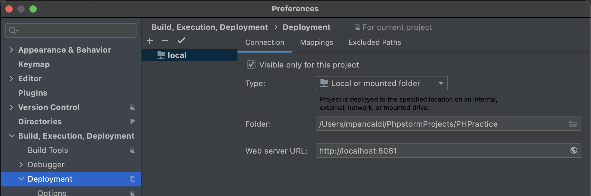
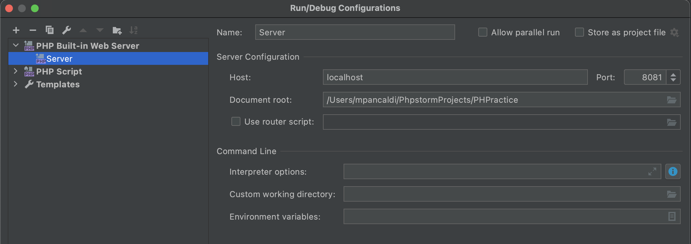

# PHPractice

## Sample tutorials
- [Guru99](https://www.guru99.com/xampp-netbeans.html#3)
- [YT - PHP Tutorial](https://www.youtube.com/watch?v=OK_JCtrrv-c)
- [YT - PHP for Drupal](https://www.youtube.com/playlist?list=PLZaG0MNecryP8fy48_Rr09uh3cJ7T65ur)

## Setup local server
[PhpStorm config](https://www.jetbrains.com/help/phpstorm/creating-local-server-configuration.html#server-url)

## Require vs include

| Include  |  Require      |
|----------|---------------|
| Issues a warning when an error occurs | Does not issue a warning |
| Execution of the script continues when an error occurs | Execution of the script stops when an error occurs. |

Generally, it’s recommended using the `include` statement so that when an error occurs, execution of the script continues to display the webmaster email address or the contact us page.

The `require` statement should be used if the entire script cannot run without the requested file.

The “include” and “require” statements can be used at any line in the source codes where you want the code to appear.

## Arrays
Why use arrays?
- Contents of Arrays can be stretched
- Arrays easily help group related information such as server login details together
- Arrays help write cleaner code.